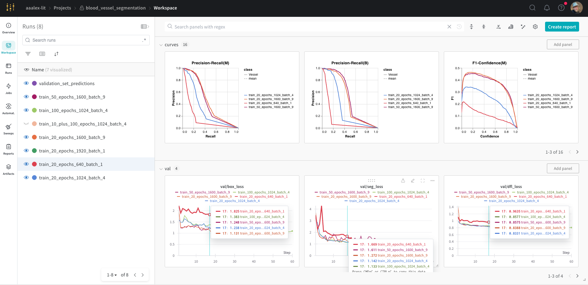
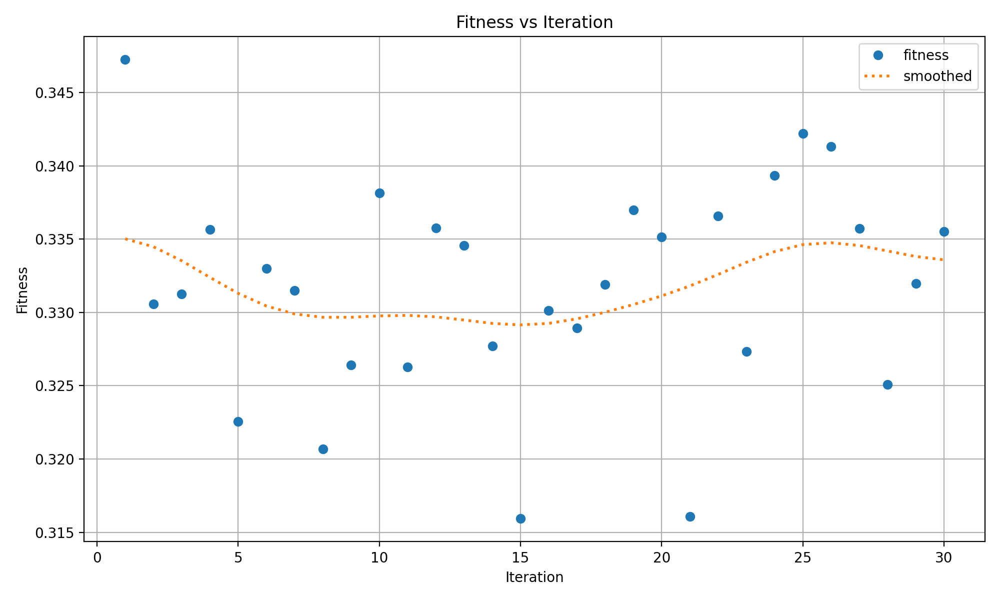
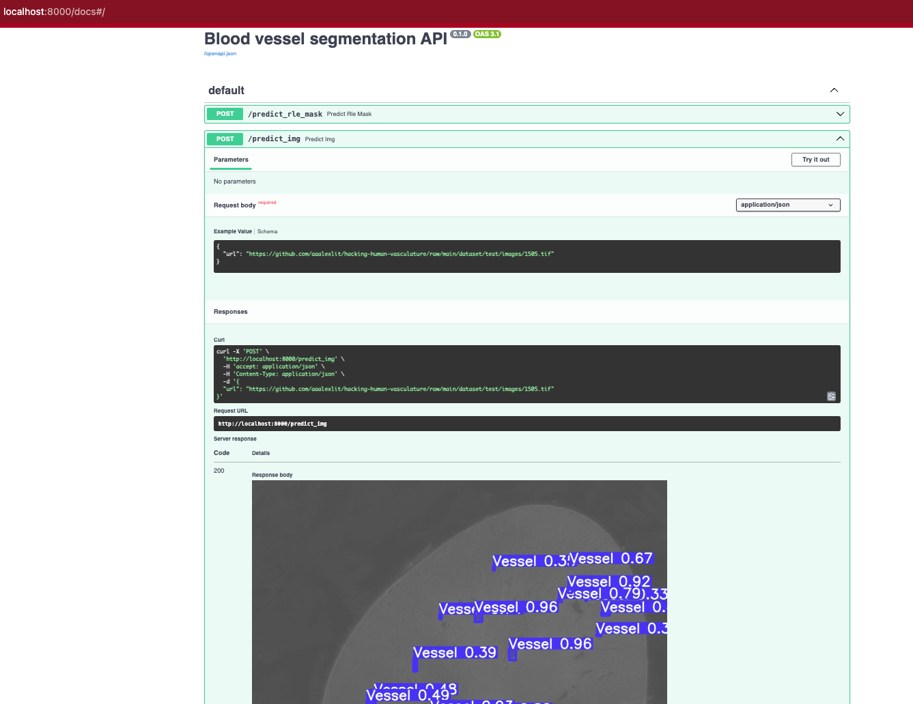
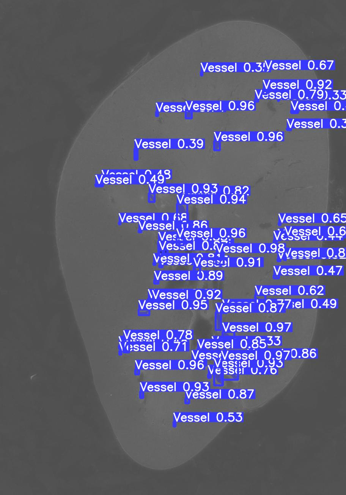

# Project information

This project intends to find a solution to the ongoing (at the time of writing January 2024) kaggle competition [SenNet + HOA - Hacking the Human Vasculature in 3D](https://www.kaggle.com/competitions/blood-vessel-segmentation/overview)

The project runs are logged to Weights&Biases:  
https://wandb.ai/aaalex-lit/blood_vessel_segmentation



## Project description

Here's a short summary of the competition description:

The goal of the competition is to segment blood vessels by creating a model trained on 3D Hierarchical Phase-Contrast Tomography (HiP-CT) data from human kidneys to help complete a picture of vasculature throughout a body.

This work will better researchers' understanding of the size, shape, branching angles, and patterning of blood vessels in human tissue.

Please see the detailed description on the [competitions' page](https://www.kaggle.com/competitions/blood-vessel-segmentation/overview/description)

In this particular project we will set a bit more humble goal. We will only use 2D data to train 
a segmentation model and we will train it only on a part of the whole data.
To solve this problem we will apply YOLOv8 segmentation model from [Ultralytics](https://docs.ultralytics.com/)
training it on the selected subset of the whole competition data.

>YOLOv8 is the latest version of YOLO by Ultralytics. As a cutting-edge, state-of-the-art (SOTA) model, YOLOv8 builds on the success of previous versions, introducing new features and improvements for enhanced performance, flexibility, and efficiency. YOLOv8 supports a full range of vision AI tasks, including detection, segmentation, pose estimation, tracking, and classification. 

## The dataset

The complete dataset is [available on Kaggle](https://www.kaggle.com/competitions/blood-vessel-segmentation/data) 
This repo contains a small part of the full dataset images along with the 
masks that were modified compared to the original dataset by converting the original
binary masks to YOLOv8-accepted text format.

>Yashvardhan Jain, Katy Borner, Claire Walsh, Nancy Ruschman, Peter D. Lee, Griffin M. Weber, Ryan Holbrook, Addison Howard. (2023). SenNet + HOA - Hacking the Human Vasculature in 3D. Kaggle. https://kaggle.com/competitions/blood-vessel-segmentation

# Reproduce the work

## Create environment

**Disclaimer:**  
I prefer to use conda because it comes with a Python interpreter of the specified version whereas with the other options like pipenv, poetry etc you need a base interpreter of a required version.
If you don't want to use conda, you can as well skip the conda environment setup and use the provided Pipfile.* to reproduce the environment or create a virtual environment of your choice (eg python's built-in `venv`), and install the dependencies using the provided [requirements.txt](requirements.txt). In the latter case you need to remember that the base interpreter's python version must be 3.10 and that 100% reproducibility is likely to be achieved but is not guaranteed.

Below are instructions for conda:

1. Clone this repo

1. Create a clean Python 3.10 based environment and activate it
    ```shell
    conda create -n blood-vessel-segmentation python=3.10
    conda activate blood-vessel-segmentation
    ```

1. Install requirements
    ```shell
    pip install -r requirements.txt 
    ```

## Run the notebooks

Spin up a jupyter server and use your browser to open a notebook from the [notebooks folder](notebooks/) by executing:

**Note on Windows OS**:  
There is some bash script used in the notebooks. I'm not 100% sure it will execute properly on **Windows** within the notebook. If it doesn't just follow the existing notebooks output.


```shell
jupyter notebook
```

Notebooks description:

### [EDA](notebooks/EDA.ipynb)
Full dataset EDA notebook.  
>**Note:** Can be run locally (proper execution on Windows in not guaranteed)  

The purpose is to explore the whole dataset and the task,
 and decide how to reduce it for the project

### [Create smaller dataset](notebooks/Create_train_val_test_datasets.ipynb)
>**Note:** Can be run locally (proper execution on Windows in not guaranteed)  

Create smaller dataset from the full one.  
The dataset obtained as a result of the notebook execution is already present in the 
notebook so the code is provided for reference, it doesn't need to be executed 
unless you want to change the dataset.

### [Baseline Training](notebooks/baseline_training.ipynb)
>**Note:**  The notebook is meant to be executed on [Google Colab](https://colab.research.google.com/)  

Initial Experiments with different images sizes and batch sizes  
Logged to WandB: https://wandb.ai/aaalex-lit/blood_vessel_segmentation

### [Hyperparameter tuning](notebooks/hyperparameter_tuning.ipynb)
>**Note:**  The notebook is meant to be executed on [Google Colab](https://colab.research.google.com/)  

The results of the experimetnts can be fount in the [hyperparameter_tuning_results folder](hyperparameter_tuning_results/)

Funny enough the best hyperparameters were achieved on the first iteration:


The best hyperparameters can be found in the [best_hyperparameters.yaml](hyperparameter_tuning_results/best_hyperparameters.yaml)

They're used in the following notebook to train the final model.

## [Final model training](notebooks/train_final_model_best_hyperparams.ipynb)

In the end it appeared that in fact it was a mistake to train image size 1024 with
batch 4 for longer even with the best hyperparametes.
It's clear from WandB graphs that image size 1600 with batch size 9 shows much better
performance with shorter training time. 
So the final model is trained with these parameters.
The training of the final model is exported to a separate script.

## Model training script

[train.py](train.py)

> **Please note that the script is designed to be trained on GPU with at least 15G of GPU RAM (I ran the training on the Google Colab T4).   
> If you try to run it on your computer and you're not on Mac and with no GPU it will most likely fail with OOM.**

I tried to run it on my Mac M2 and it worked but still estimated to run 4 minutes
per epoch that is way too much compared to ~25 seconds per epoch on Google Colab with T4

To run the training execute (make sure to have `blood-vessel-segmentation` environment is activated)

```shell
python train.py
```

# Model deployment 

Model is deployed with [FastAPI](https://fastapi.tiangolo.com/) + Uvicorn 

## Running locally
To run the service locally execute
```shell
python predict.py
```
That will spin up uvicorn server on port 8000 (make sure it's not occupied)

The API can be tested directly in the browser using the built-in Swagger UI, accessible at http://127.0.0.1:8000/docs.



There are 2 endpoints in the service

1. `/predict_rle_mask`:  
    returns the [Run-Length Encoded](https://en.wikipedia.org/wiki/Run-length_encoding) predicted mask.  
   This format is required for competition submission.  
   It's a lossless format and can be easily decoded back to a matrix on the other end.

   Alternatively it can be tested from the command line using `curl`
    ```shell
    curl -X 'POST' \
    'http://localhost:8000/predict_rle_mask' \
    -H 'accept: application/json' \
    -H 'Content-Type: application/json' \
    -d '{
    "url": "https://github.com/aaalexlit/hacking-human-vasculature/raw/main/dataset/test/images/1505.tif"
    }'
    ```

2. `/predict_img`:  
    returns a JPG image with the predicted masks and boxes.  
    Added for the sake of quick assessment

   Alternatively it can be tested from the command line using `curl`
    ```shell
    curl -X 'POST' \
    'http://localhost:8000/predict_img' \
    -H 'accept: application/json' \
    -H 'Content-Type: application/json' \
    -d '{
    "url": "https://github.com/aaalexlit/hacking-human-vasculature/raw/main/dataset/test/images/1505.tif"
    }' --output result.jpg
    ```

    Running this command will download the prediction as `result.jpg` file.
    